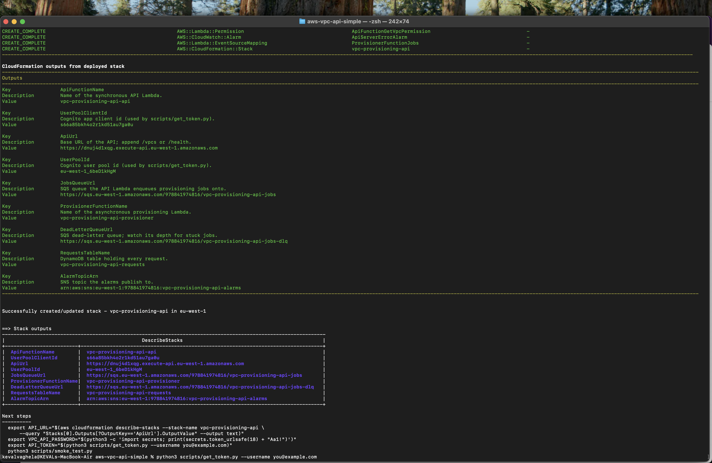
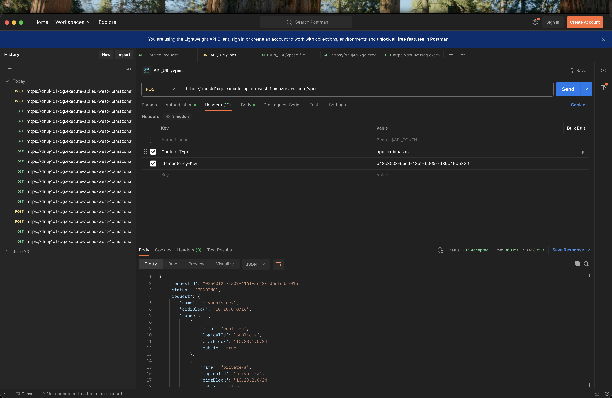

# vpc-provisioning-api

An authenticated, asynchronous AWS API that provisions a **VPC with multiple
subnets** and stores the result so it can be read back afterwards.

Built with **AWS SAM** (API Gateway HTTP API + Cognito + two Lambdas + DynamoDB +
SQS) and written in **Python 3.12**.

---

## Contents

- [Quick start](#quick-start)
- [1. What it does](#1-what-it-does)
- [2. Architecture](#2-architecture)
- [3. Design decisions](#3-design-decisions)
- [4. Repository layout](#4-repository-layout)
- [5. Deploy](#5-deploy)
- [6. Use it](#6-use-it)
- [7. API reference](#7-api-reference)
- [8. Screenshots](#8-screenshots)

---

## Quick start

```bash
# 1. Local setup: a virtualenv with ruff and boto3.
python3 -m venv .venv
.venv/bin/pip install -r requirements-dev.txt
.venv/bin/ruff check .                    # lint

# 2. Deploy (needs the AWS CLI + SAM CLI and valid credentials).
./scripts/deploy.sh

# 3. Get a token and run the end-to-end smoke test.
export API_URL="$(aws cloudformation describe-stacks --stack-name vpc-provisioning-api \
    --query "Stacks[0].Outputs[?OutputKey=='ApiUrl'].OutputValue" --output text)"
export VPC_API_PASSWORD="$(python3 -c 'import secrets; print(secrets.token_urlsafe(18) + "Aa1!")')"
export API_TOKEN="$(python3 scripts/get_token.py --username you@example.com)"
python3 scripts/smoke_test.py

# 4. Tear the networks down, then the stack (the API has no delete route).
python3 scripts/cleanup.py --all --yes
sam delete --stack-name vpc-provisioning-api --region eu-west-1
```

---

## 1. What it does

* Accepts a JSON payload describing a desired network (a VPC CIDR plus one or
  more subnets) through an authenticated API.
* Validates the whole document up front and rejects bad input in milliseconds.
* Records the request in DynamoDB as `PENDING` and returns **`202 Accepted`** with
  the new `requestId`, which is used to poll for the result.
* An **SQS-backed worker** builds the VPC and its subnets, spreading the subnets
  that do not name an availability zone across zones.
* Records the real AWS resource ids against the request, which can then be read
  back at any time with `GET /vpcs/{requestId}`.

---

## 2. Architecture

Three planes, each with one responsibility:

```
                       ┌───────────────────────────────────────────────────────┐
   Client              │ EDGE (API Gateway HTTP API)                           │
   Bearer JWT ────────▶│  Cognito JWT authorizer: verifies signature, issuer,  │
                       │  audience and expiry BEFORE any code runs.            │
                       │  No scopes or groups => any authenticated user is     │
                       │  authorised.  Only GET /health opts out.              │
                       └───────────────────────┬───────────────────────────────┘
                                               │
                       ┌───────────────────────▼───────────────────────────────┐
                       │ CONTROL PLANE  (api Lambda, synchronous)              │
                       │  1. validate the document                             │
                       │  2. write the record as PENDING  ──▶ DynamoDB         │
                       │  3. send { requestId } to        ──▶ SQS              │
                       │  4. return 202 + requestId                            │
                       └───────────────────────┬───────────────────────────────┘
                                               │  SQS jobs queue
                                               │  (5 failed receives ──▶ DLQ)
                       ┌───────────────────────▼───────────────────────────────┐
                       │ PROVISIONING PLANE (provisioner Lambda, asynchronous) │
                       │  claim via conditional write (PENDING → PROVISIONING) │
                       │  create/adopt resources via the EC2 API               │
                       │  COMPLETED, or roll everything back and FAILED        │
                       └───────────────────────────────────────────────────────┘
```

| Component | Why it is there |
|---|---|
| API Gateway HTTP API | Cheapest front door; the native JWT authorizer runs at the edge. |
| Cognito user pool | Issues the JWTs the authorizer validates. Admin-create only. |
| `api` Lambda | Synchronous control plane: validate, record, enqueue. |
| DynamoDB `Requests` table | Single table holding every request; also the state machine. |
| SQS `jobs` queue | Decouples the API from slow EC2 work; gives retries and backpressure. |
| SQS dead-letter queue | Holds messages that failed five times, for a human to inspect. |
| `provisioner` Lambda | Asynchronous worker: the only component that talks to EC2. |

---

## 3. Design decisions

### Four decisions that shaped this

**1. Direct boto3 calls instead of generated CloudFormation.**
Generating a nested stack per request would hand ordering and rollback to
CloudFormation and make idempotency hard to reason about. Calling the EC2 API
directly gives explicit control over all three, and makes the ownership tags
below possible.

**2. Asynchronous, because the API would otherwise time out.**
API Gateway enforces a 29-second limit while creating a VPC with subnets can
exceed it, so `POST /vpcs` only records and enqueues work and returns `202`. The
client polls `GET /vpcs/{requestId}`.

**3. Tag-on-create is the ownership contract.**
Every resource is created with `ManagedBy`, `prov:requestId` and `prov:logicalId`
attached *at creation time* via `TagSpecifications`. One mechanism buys three
things: the worker's IAM policy can refuse to delete anything without the tag, a
resumed request can find what it already built, and `cleanup.py` can list the
blast radius before deleting.

**4. Validation is the cheapest place to fail.**
A malformed CIDR is rejected in about two milliseconds; discovering the same
problem after a VPC exists costs a rollback and several EC2 calls. Validation
therefore collects **every** problem and returns them together, so a caller fixes
one round trip instead of many.

### The data model

One table, `{ProjectName}-requests`, with a composite key so related items could be
added later without a migration.

| Attribute | Meaning |
|---|---|
| `pk` / `sk` | `REQUEST#<requestId>` / `META` |
| `status` | `PENDING` \| `PROVISIONING` \| `COMPLETED` \| `FAILED` |
| `request` | The normalised request document |
| `resources` | `vpcId`, `vpcCidrBlock`, `subnets[]` |
| `attempts` | How many times a worker has claimed the request |
| `createdAt` / `updatedAt` | ISO-8601 UTC, millisecond precision |
| `ownerSub` / `ownerEmail` | Who asked, taken from the JWT claims |
| `idempotencyKey` / `bodyHash` | Present only when the header was supplied |
| `error` | `{code, detail}` from the last failure |
| `deletedAt` / `deletedResources` | Absent while the network exists; set by `cleanup.py` |
| `gsi1pk` / `gsi1sk` | `REQUEST` + `createdAt` — "list everything, newest first" |
| `gsi2pk` / `gsi2sk` | `IDEMPOTENCY#<key>` + `createdAt` — "has this key been used?" |

Two details carry weight:

* **`createdAt` is fixed-width ISO-8601 UTC**, so it sorts correctly as a *string*.
  That is what lets `gsi1` serve "newest first" with `ScanIndexForward=False` — no
  `Scan`, no in-memory sort.
* **`gsi2` is a point read, not a filter**, so an idempotency check does not get
  slower as the table grows.

`status` and *existence* are deliberately separate questions: `status` records how
provisioning went and stays `COMPLETED` forever, while `deletedAt` answers whether the
network still exists. Collapsing them into a `DELETED` status was rejected, because
"provisioning succeeded, then an operator removed it" is more accurate than one
collapsed field.

### Concurrency: one claim, one winner

SQS gives at-least-once delivery, so the same request can be handed to two workers at
the same moment. The protection is a single conditional write:

```
UpdateItem
  SET   #status = 'PROVISIONING', attempts = if_not_exists(attempts, 0) + 1
  WHERE #status = 'PENDING'
```

Exactly one caller can satisfy `#status = 'PENDING'`. The loser receives
`ConditionalCheckFailedException`, which the repository converts into a plain
`False` — losing a race is a normal outcome, not an error. Every transition uses the
same technique, so **the database is the final authority on the state machine**;
`ALLOWED_TRANSITIONS` is asserted in process as well, so a programming mistake fails
immediately instead of corrupting a record.

A claim is **not** a lease: if a worker dies mid-flight the record stays
`PROVISIONING` until the message is redelivered, and `attempts` still rises on each
claim so retries stay bounded.

### Idempotency, in three layers

Three mechanisms for three different failure modes:

| Layer | Mechanism | Protects against |
|---|---|---|
| HTTP | `Idempotency-Key` + `bodyHash` in `gsi2` | A client retrying. Same key + same body returns the original with `200`; same key + different body is a `409`. |
| Job | The conditional claim above | SQS redelivering a message. The second delivery finds the record is no longer `PENDING` and does nothing. |
| Resource | Ownership tags + the `_ensure_*` helpers | A worker dying *during* provisioning. The next delivery finds the VPC and subnets by `prov:requestId` and reuses them. |

The resource layer is per-resource rather than all-or-nothing. The shorter
implementation — "if the VPC exists, adopt the whole network and stop" — is wrong: a
crash after `CreateVpc` but before `CreateSubnet` would leave a VPC with no subnets,
and the next delivery would adopt it and report `COMPLETED` for a network that was
never finished. `provision()` therefore calls `_ensure_vpc` and `_ensure_subnets`,
each of which reuses what exists and creates only what is missing.

### Failure taxonomy and the retry policy

EC2 errors fall into three behavioural classes. Getting this wrong is what makes a
system burn quota on hopeless retries — or give up on a transient blip.

| Class | Examples | Behaviour |
|---|---|---|
| `TransientError` | `RequestLimitExceeded`, `Throttling`, `InternalError`, `DependencyViolation` | Release back to `PENDING` and let SQS redeliver, until `MaxAttempts`. |
| `QuotaError` | `VpcLimitExceeded`, `SubnetLimitExceeded` | Fail immediately and roll back; retrying cannot help until a human acts. |
| `ProvisioningFailure` | `UnauthorizedOperation`, `InvalidSubnet`, anything unclassified | Fail immediately and roll back. |

Classification lives in one place, `errors.classify_ec2_error()`. An *unexpected*
exception is treated as transient: retrying is the safer default, and the attempt
counter guarantees the run ends in a rollback rather than looping forever.

**"Release for retry" takes two steps, and both are required.** `release_for_retry()`
moves the record `PROVISIONING -> PENDING` so the redelivery can be claimed again,
*and* the handler re-raises so `lambda_handler` reports a `batchItemFailures` entry,
which is what makes SQS redeliver at all. Only the first leaves a stuck request; only
the second produces a retry that nothing can claim.

**Rollback** deletes in reverse order of creation, and the order is not cosmetic: EC2
refuses to delete a VPC that still has subnets. Every step is best-effort, so one
stubborn resource cannot strand the rest, and the ids that were removed are returned so
they can be recorded.

---

## 4. Repository layout

```
.
├── template.yaml                 SAM stack: API, auth, functions, table, queue
├── samconfig.toml                Default deploy arguments (so deploy is one command)
├── pyproject.toml                Ruff lint configuration
├── requirements-dev.txt          Local tooling (ruff, boto3)
├── src/
│   ├── requirements.txt          Runtime dependencies (boto3 ships with Lambda)
│   └── vpc_api/
│       ├── config.py             Environment settings + lazily cached boto3 clients
│       ├── errors.py             Error taxonomy: HTTP-facing and retry-facing
│       ├── models.py             Domain dataclasses + the request state machine
│       ├── validation.py         Pre-flight document validation (all errors at once)
│       ├── repository.py         DynamoDB persistence + conditional writes
│       ├── provisioning.py       Direct EC2 calls: create, adopt, roll back
│       ├── responses.py          HTTP envelopes, RFC 7807 problems, security headers
│       └── handlers/
│           ├── api.py            Synchronous Lambda behind API Gateway
│           └── provisioner.py    Asynchronous Lambda behind SQS
├── scripts/                      Deployment, token, verification and cleanup helpers
└── .github/workflows/ci.yml      Lint + validate + build on every push
```

The internal boundaries are deliberate: `handlers` only translate transport,
`validation` only decides what a valid request looks like, `repository` is the only
module that touches DynamoDB, and `provisioning` is the only module that touches EC2.

---

## 5. Deploy

### Prerequisites

```bash
brew install awscli aws-sam-cli     # or: pipx install aws-sam-cli
brew install python@3.12            # `sam build` needs the runtime it targets
```

### Credentials

The usual mechanisms work — `aws configure`, `aws sso login`, or `aws login`. One
caveat: `aws login` (AWS CLI 2.36+) stores its session in a provider plain boto3
cannot read, so a script fails with `MissingDependencyException` even though the CLI
works. Install the extra (`requirements-dev.txt` already includes it):

```bash
.venv/bin/pip install "botocore[crt]"
```

Or export short-lived credentials into the shell instead, which needs no install:

```bash
eval "$(aws configure export-credentials --format env)"
```

The CLI and boto3 use different credential plumbing, so check both halves:

```bash
aws sts get-caller-identity
.venv/bin/python -c "import boto3; print(boto3.client('sts').get_caller_identity()['Arn'])"
```

### One command

```bash
./scripts/deploy.sh
```

That runs `sam validate --lint`, `sam build`, `sam deploy`, then prints the stack
outputs. Everything is one CloudFormation stack, so teardown is one command too.

### Parameters

| Parameter | Default | Meaning |
|---|---|---|
| `ProjectName` | `vpc-provisioning-api` | Name prefix **and** the `ManagedBy` tag value. |
| `MaxSubnetsPerRequest` | `16` | Per-request subnet ceiling; bounds blast radius and cost. |
| `MaxAttempts` | `3` | Attempts before the worker gives up and rolls back. |
| `ProvisionerConcurrency` | `5` | Caps how fast the worker consumes EC2 capacity. |
| `LogRetentionDays` | `30` | CloudWatch Logs retention. |
| `LogLevel` | `INFO` | `DEBUG` … `ERROR`. |

Override any of them per deployment:

```bash
./scripts/deploy.sh --parameter-overrides ProjectName=my-api
```

### What gets created

An API Gateway HTTP API and stage, a Cognito user pool and app client, two Lambda
functions, one DynamoDB table with two GSIs, two SQS queues, two log groups, and
IAM roles scoped to those resources.

---

## 6. Use it

### Get a token

The user pool is admin-create-only, so `scripts/get_token.py` creates the user
idempotently and prints an ID token:

```bash
export VPC_API_PASSWORD="$(python3 -c 'import secrets; print(secrets.token_urlsafe(18) + "Aa1!")')"
export API_TOKEN="$(python3 scripts/get_token.py --username you@example.com)"
export API_URL="$(aws cloudformation describe-stacks --stack-name vpc-provisioning-api \
    --query "Stacks[0].Outputs[?OutputKey=='ApiUrl'].OutputValue" --output text)"
```

### Create a network

```bash
curl -sX POST "$API_URL/vpcs" \
  -H "Authorization: Bearer $API_TOKEN" \
  -H "Content-Type: application/json" \
  -H "Idempotency-Key: $(uuidgen)" \
  -d '{
    "name": "payments-dev",
    "cidrBlock": "10.20.0.0/16",
    "subnets": [
      {"name": "subnet-a", "cidrBlock": "10.20.1.0/24"},
      {"name": "subnet-b", "cidrBlock": "10.20.2.0/24"}
    ],
    "tags": {"env": "dev"}
  }' | jq
```

The response is `202 Accepted`, with the new `requestId` in the body:

```json
{
  "requestId": "9f1c...",
  "status": "PENDING",
  "request": { "...": "your payload, normalised" },
  "attempts": 0,
  "createdAt": "2026-01-01T00:00:00.000Z",
  "updatedAt": "2026-01-01T00:00:00.000Z"
}
```

### Poll it

```bash
curl -s "$API_URL/vpcs/9f1c..." -H "Authorization: Bearer $API_TOKEN" | jq
```

Once the worker finishes, the record carries the real AWS ids it created:

```json
{
  "requestId": "9f1c...",
  "status": "COMPLETED",
  "attempts": 1,
  "resources": {
    "vpcId": "vpc-0abc123",
    "vpcCidrBlock": "10.20.0.0/16",
    "subnets": [
      {"logicalId": "subnet-a", "subnetId": "subnet-0aaa", "cidrBlock": "10.20.1.0/24", "availabilityZone": "eu-west-1a"},
      {"logicalId": "subnet-b", "subnetId": "subnet-0bbb", "cidrBlock": "10.20.2.0/24", "availabilityZone": "eu-west-1b"}
    ]
  }
}
```

### List, and check liveness

```bash
curl -s "$API_URL/vpcs?limit=10" -H "Authorization: Bearer $API_TOKEN" | jq '.count'
curl -s "$API_URL/health" | jq          # no token required
```

### Tear a network down

The API exposes no delete route, so teardown is an operator action. These are the
only teardown commands in this document; other sections link back here.

```bash
python3 scripts/cleanup.py --list                        # what exists, grouped by request
python3 scripts/cleanup.py --request-id <requestId> --yes
python3 scripts/cleanup.py --all --yes                   # everything this service owns
```

The DynamoDB record is kept as an audit trail and stamped with `deletedAt` and
`deletedResources`, so it stops implying the network still exists.

---

## 7. API reference

Every route requires a valid Cognito JWT in `Authorization: Bearer <token>`
except `GET /health`.

| Method | Path | Success | Notes |
|---|---|---|---|
| `POST` | `/vpcs` | `202` | Submit a network to build; the body carries `requestId`. `200` on idempotent replay. |
| `GET` | `/vpcs?limit=N` | `200` | List requests, newest first. `limit` 1–100, default 20. |
| `GET` | `/vpcs/{requestId}` | `200` | Read one request and the AWS ids it produced. |
| `GET` | `/health` | `200` | Liveness probe. **Unauthenticated.** |

There is no `DELETE` route; teardown is out of band (see [Tear a network down](#tear-a-network-down)).

### Request body (`POST /vpcs`)

| Field | Required | Rules |
|---|---|---|
| `name` | yes | `^[A-Za-z0-9][A-Za-z0-9._-]{0,63}$`; becomes the `Name` tag. |
| `cidrBlock` | yes | IPv4, RFC 1918 only, prefix between `/16` and `/28`. |
| `subnets` | yes | 1 … `MaxSubnetsPerRequest` entries. |
| `subnets[].name` | yes | Unique within the request; becomes `prov:logicalId`. |
| `subnets[].cidrBlock` | yes | Strictly inside the VPC CIDR; no overlaps. |
| `subnets[].availabilityZone` | no | e.g. `eu-west-1a`. If omitted, zones are spread round-robin. |
| `tags` | no | String pairs. `aws:`, `prov:` and `ManagedBy` are reserved. |

Unknown fields are rejected rather than ignored, and the body is capped at 64 KB
before it is parsed.

### `Idempotency-Key` header (optional)

Up to 128 characters from `[A-Za-z0-9._:-]`.

* Same key **and** same body → `200` with the **original** request; no second job.
* Same key **and** different body → `409`.

### Status codes

| Code | When |
|---|---|
| `202 Accepted` | The request was recorded and queued. |
| `200 OK` | A read succeeded, or an idempotent replay returned the original. |
| `400 Bad Request` | Validation failed. |
| `401 Unauthorized` | No valid token. Rejected by the authorizer, before the Lambda runs. |
| `404 Not Found` | No such request, or no such route (including `DELETE`). |
| `409 Conflict` | Idempotency key reused with a different body. |
| `500 Internal Server Error` | Something unexpected; details are logged, never returned. |

### Errors are RFC 7807

Every error uses `application/problem+json`, and validation errors list **all**
problems at once:

```json
{
  "type": "https://docs.example.com/problems/validation_failed",
  "title": "Request Validation Failed",
  "status": 400,
  "code": "validation_failed",
  "detail": "2 validation error(s) found; all of them are listed in 'errors'.",
  "instance": "/vpcs",
  "errors": [
    {"field": "name", "message": "must match ^[A-Za-z0-9][A-Za-z0-9._-]{0,63}$"},
    {"field": "subnets[1].cidrBlock", "message": "overlaps subnets[0].cidrBlock (10.20.1.0/24)"}
  ]
}
```

Every response also carries `Cache-Control: no-store`,
`X-Content-Type-Options: nosniff` and `Strict-Transport-Security`.

### Request lifecycle

```
PENDING ──claim──▶ PROVISIONING ──success──▶ COMPLETED
   │                   │
   │                   ├── transient error, attempts left ──▶ back to PENDING
   │                   │
   │                   └── retries exhausted ──▶ FAILED (rolled back)
   │
   └── could not be queued ──▶ FAILED
```

`COMPLETED` and `FAILED` are terminal. Every transition is enforced by a DynamoDB
`ConditionExpression`, so the database — not application code — is the final
authority on whether a state change is legal. `attempts` records how many times a
worker tried.

---

## 8. Screenshots

Captured on **2026-09-29** against the deployed stack in `eu-west-1`, using
Postman. Two representative shots are below; the full set is in
[`screenshots/`](screenshots/).




